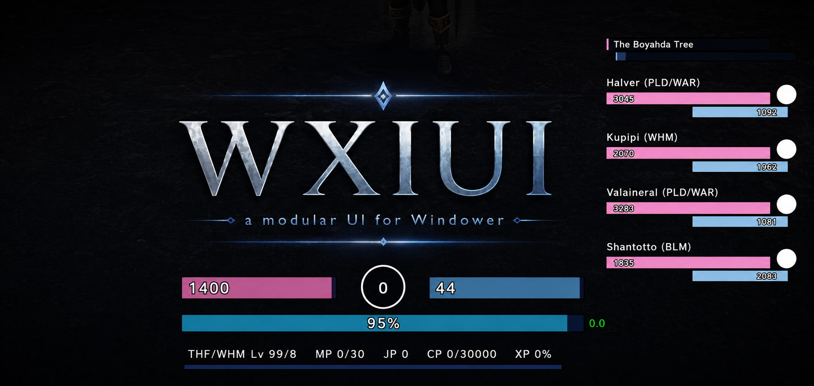
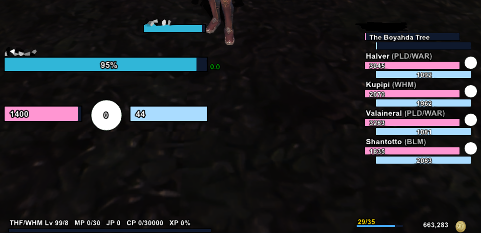
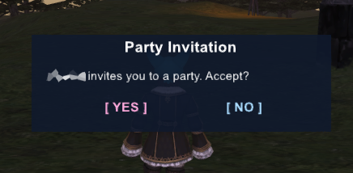
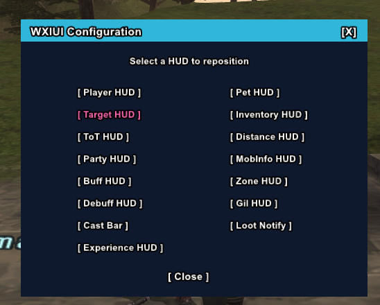
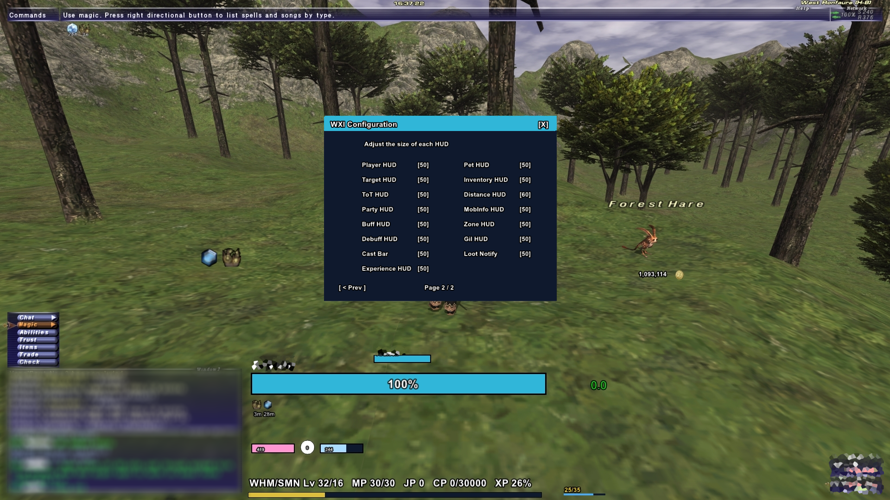
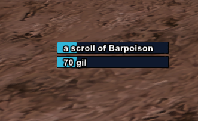

  

Support my work:   
# WXIUI

WXIUI - A modular UI for Final Fantasy XI
-------------------------------------------
Llevo años utilizando Windower para jugar a mi juego favorito, y siempre he querido una interfaz sofisticada como logró hacer el genial equipo de XIUI para Ashita. Hasta el momento habían no demasiadas opciones similares así que me animé a crear mi propia UI basada en el trabajo hecho en XIUI. Sin embargo no soy desarrollador y este es mi primer addon, el cual me ha ayudado la IA y aunque he hecho cientos de pruebas y he corregido todos los errores que he podido, es posible que aparezca alguno.  

English: 
  
I’ve been using Windower for years to play my favorite game, and I’ve always wanted a sophisticated interface like the amazing XIUI team managed to create for Ashita. Until now, there haven’t been many similar options available, so I decided to create my own UI inspired by the work done with XIUI.

However, I’m not a developer, and this is my first addon. AI helped me build it, and although I’ve done hundreds of tests and fixed every issue I could find, it’s possible that some bugs may still appear.

  

## Features

- Buff Tracker
- Cast Bar
- Distance HUD
- Config Menu
- Trust Support
- Modular Architecture
- Grid snapping system for pixel-perfect and precise HUD positioning
- Hide or show any HUD
- Trade request window
- Party request window
- Loot notification
- Scalable HUDs system
- Pet Window
- ZoneMap transition integrated
- InfoBar integrated
- Gil tracker (Gil per hour and Session)
- Inventory tracker
- Dynamic TP color design
- Tooltips on buffs, debuffs, inventory hud and gil hud

  

## Commands

- //wxiui or //wxiui help 
- //wxiui config
- //wxiui move <hud>
- //wxiui hide <hud>
- //wxiui show <hud>
- //wxiui toggle <hud>

## Dependencies

WXIUI requires `libs.lua` to function but is included. The addon shouldn't cause any issues, but if it does you must download it and place it inside your Windower `addons/wxiui` folder.
https://github.com/Windower/Lua/blob/dev/addons/Nostrum/prims.lua

## Usage

Using the `//wxiui config` command, you can access the interface configuration menu. On the first page, you can move all WXIUI components independently anywhere on the screen. On the second page, clicking the percentage value (50% by default) increases the scale in 10% increments, allowing you to resize the desired HUD. The available range goes from 30% to 100%, enabling WXIUI to adapt seamlessly to both Steam Deck and 4K displays.
The `//wxiui move <hud>` command allows you to reposition any interface element without having to open the main configuration menu. The `hide` command hides the selected HUD, for example, `//wxiui hide partyhud` will hide the party HUD. The `show` command makes it visible again, while `hide` acts as a toggle, switching the HUD between hidden and visible states.

  

  

## Loot Notification

The notification system created by the XIUI team to alert players when a new item is added to their inventory is something that always fascinated me, so I wanted to bring a similar feature to WXIUI. This system can display notifications for up to 5 items obtained after defeating monsters, with each notification remaining on screen for 5 seconds. Like the rest of the HUD elements, it can be freely moved and resized to suit your preferences.

  

## Acknowledgments

- To the XIUI team for Ashita, whose work inspired this project. I honestly felt a bit envious of what they had created because we didn’t have anything comparable on Windower. Their ideas have inspired many addon developers to improve their own projects and have helped make FFXI a better and more accessible game for everyone.
- To the creators of InfoBar for helping us decipher every monster. Thanks to their work, I was able to integrate part of their functionality into WXIUI, as I consider it one of the most essential addons for playing the game.

A special thanks to Kenshi, who was not only a fellow player in the past, but also shares the same country of origin as me. Spaniards play FFXI too! 🇪🇸
- To the XIVParty team, whose work also served as inspiration for certain aspects of this project and from whom I borrowed a few lines of code. Thanks to their efforts, countless players were able to get into FFXI with a more modern and user-friendly interface, helping to overcome one of the biggest barriers for newcomers.
- To azamorapl for bringing a touch of FFXIV to FFXI with the fantastic ZoneName addon, which I have integrated into WXIUI. I’m generally not a fan of making one game look like another, but ZoneName is simply wonderful.
- To the creators of GrowthGauge, a simple yet incredibly useful addon thanks to its elegant simplicity. Years ago, it took me a long time to track it down online, and now I wanted to bring it back by adapting its concept into WXIUI.
- To PasiXI for TargetBar, from which I also drew data and inspiration that helped make WXIUI’s own Target Bar possible. It’s another one of those addons whose usefulness you don’t fully appreciate until you actually try it.
- And to the teams behind GilTracker and InvSpace for their excellent work on both addons. I hope you enjoy the way I’ve brought their ideas into WXIUI, along with the improvements and enhancements I’ve added along the way.
